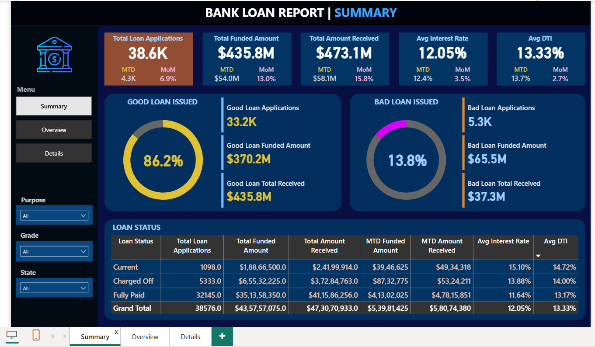
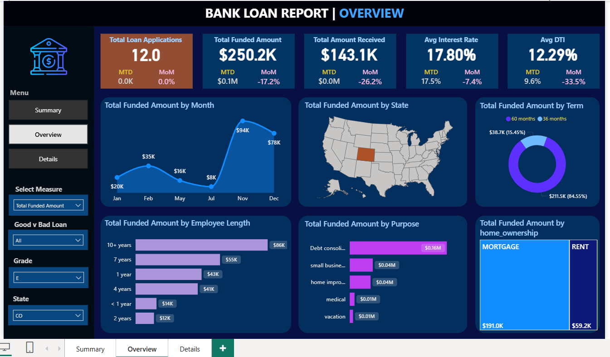
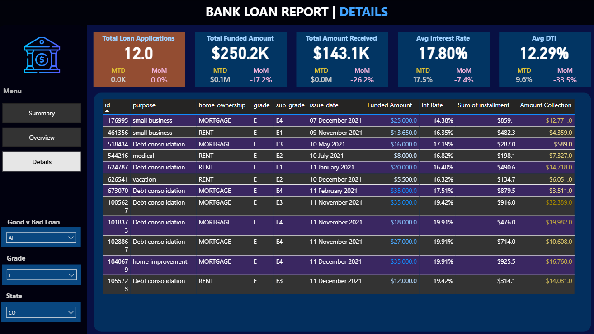

# Finance Analytics Capstone Project  

This capstone project provides an **end-to-end, real-world data analysis experience** in the **Finance domain**, leveraging industry-standard tools such as **Power BI, SQL, Python, Excel, and Tableau**.  
The project focuses on designing **Key Performance Indicators (KPIs)**, building **financial dashboards**, and deriving **business insights** from lending datasets.  

---

## 📌 Problem Statement  

The financial sector requires **robust reporting and analytics** to monitor loan applications, repayments, and customer financial health. This project addresses these requirements by developing **KPIs** and **interactive dashboards** that enable stakeholders to make data-driven decisions on **loan disbursements, borrower risk assessment, and portfolio performance**.  

---

## 🔑 Key Performance Indicators (KPIs) Requirements  

1. **Total Loan Applications**  
   - Calculate the total number of loan applications received during a specified period.  
   - Monitor the **Month-to-Date (MTD)** Loan Applications.  

2. **Total Funded Amount**  
   - Track the total funds disbursed as loans.  
   - Include the **MTD Total Funded Amount** metric.  

3. **Total Amount Received**  
   - Measure the total repayments collected from borrowers.  
   - Analyze **MTD Total Amount Received** for monitoring repayment trends.  

4. **Average Interest Rate**  
   - Compute the average interest rate across all loans.  
   - Provides insights into the overall **cost of lending** for the bank.  

5. **Average Debt-to-Income Ratio (DTI)**  
   - Evaluate the average DTI of borrowers.  
   - Helps assess **financial health** and repayment capacity of customers.  

---

## 📊 Data Visualization & Charts  

To transform financial data into **actionable insights**, the following visualizations were created:  

- **Monthly Trends by Issue Date (Line/Area Chart)**  
  - Identifies seasonality and long-term lending activity patterns.  

- **Regional Analysis by State (Bar Chart)**  
  - Highlights regions with significant lending activity.  
  - Detects regional disparities in loan distribution.  

- **Loan Term Analysis (Donut Chart)**  
  - Shows the distribution of loans across **different term lengths**.  

- **Employee Length Analysis (Bar Chart)**  
  - Examines lending metrics by borrower **employment history**.  
  - Reveals how job stability impacts loan approvals.  

- **Loan Purpose Breakdown (Bar Chart)**  
  - Provides a breakdown of loans by **purpose** (e.g., credit card, small business, debt consolidation).  

- **Home Ownership Analysis (Tree/Heat Map)**  
  - Visualizes loan applications and funding segmented by **home ownership status**.  

---

## 📊 Power BI Dashboards  

Here are snapshots of the interactive dashboards created in **Power BI**:

### Dashboard 1 – [Summary]  

### Dashboard 2 – [Overview]  

### Dashboard 3 – [Details]  

> 🔔 To view interactive dashboards, open the `.pbix` files in Power BI Desktop.  

---

## 🛠️ Tech Stack  

- **SQL** – Data extraction & transformation  
- **Python** – Data cleaning, EDA, and financial modeling  
- **Excel** – Financial calculations and pivot analysis  
- **Power BI** – Interactive dashboards & visualization  
- **Tableau** – Additional data storytelling & reporting  

---

